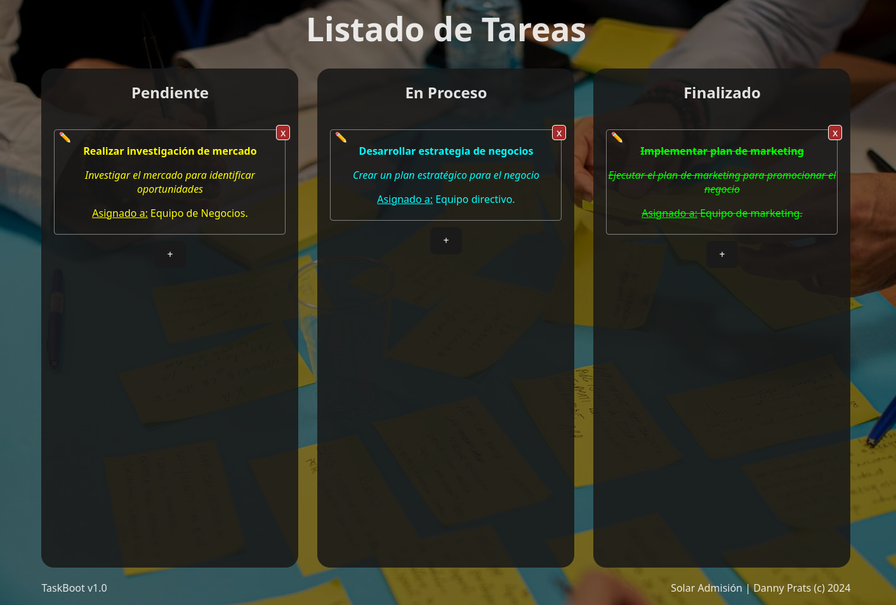

# Proyecto
Prueba Técnica para Desarrollador Java, Spring Boot y Docker

Objetivo: Evaluar las habilidades del candidato en el desarrollo de aplicaciones Java con Spring Boot y la implementación de Docker para la contenerización y despliegue.

## Requisitos

* Experiencia en Java (Versión 11 min)
* Conocimiento de Spring Boot (2.7 min)
* Experiencia con Docker
* Capacidad de análisis y resolución de problemas
* Habilidad para trabajar de forma autónoma y en equipo

## Descripción de la prueba

El candidato deberá desarrollar una aplicación web simple utilizando Spring Boot que exponga un API REST para la gestión de una lista de tareas. La aplicación deberá cumplir con los siguientes requisitos:

## Funcionalidades

* Listar todas las tareas
* Agregar una nueva tarea
* Eliminar una tarea
* Actualizar una tarea

## Tecnologías

* Java
* Spring Boot
* Spring Data JPA
* H2 (base de datos en memoria)
* Docker

## Entregables

* Código fuente de la aplicación Java
* Dockerfile para la construcción de la imagen
* README con instrucciones para ejecutar la aplicación

## Evaluación

La prueba se evaluará en base a los siguientes criterios:

* Corrección funcional: La aplicación debe cumplir con todas las funcionalidades especificadas.
* Calidad del código: El código debe ser limpio, legible y bien documentado.
* Uso de Spring Boot: La aplicación debe aprovechar las características de Spring Boot para simplificar el desarrollo.
* Uso de Docker: El Dockerfile debe estar correctamente escrito y permitir la construcción de la imagen de la aplicación.
* Documentación: El README debe contener instrucciones claras y precisas para ejecutar la aplicación.
* Se considerará la arquitectura del proyecto

## Tiempo estimado
* 4 horas

## Instrucciones de carga

* Crear un fork del proyecto, registrarlo como "dev" seguido de los 3 últimos números de su CI. Ejemplo: "dev123"
* Crear una rama feature a partir del main, con la misma metodología indicada arriba. Ejemplo: "feature/dev123"
* Solicitar el PR

---

# TaskBoot App

VERSION: 1.0.0

Desarrollador: Daniel Prats.



## Descripción del Proyecto
Aplicación web responsive que funciona como un Kanban básico. El principal objetivo de la aplicación es permitir a los usuarios agregar tareas a un tablero, cambiar el estado de las tareas entre tres opciones: Pendiente, En Proceso y Finalizado, y proporcionar información básica sobre cada tarea.

Live Preview: http://168.138.229.59/solar/taskboot/

## Especificaciones Funcionales
1. **Listado de Tareas:**
   - El tablero tiene tres columnas: Pendiente, En Proceso y Finalizado.
   - Las tareas se representan visualmente en la columna correspondiente al estado actual.
2. **Agregar Tareas:**
   - Los usuarios pueden agregar nuevas tareas al tablero.
   - Al agregar una tarea, se deben recopilar tres datos principales: nombre de la tarea, descripción de la tarea y a quién está asignada.
3. **Cambiar Estado de Tareas:**
   - Los usuarios pueden cambiar el estado de una tarea de Pendiente a En Proceso y de En Proceso a Finalizado.
   - La interfaz proporciona una manera intuitiva de realizar estos cambios de estado.
4. **Visualización de Tareas:**
   - Cada tarea en el tablero muestra información clave, como nombre, descripción y persona asignada.
   - La visualización de las tareas es clara y fácil de entender.

## Especificaciones Técnicas
1. **Tecnologías:**
   - Frontend: React 18 (tested with node 20.3.1)
   - Backend: Spring Boot 3.2.3 / Java 17 / Maven 3.6.3
2. **Responsive Design:**
   - La aplicación es completamente responsive para garantizar una experiencia de usuario consistente en diferentes dispositivos (computadoras de escritorio, tabletas, teléfonos).
3. **Almacenamiento de Datos:**
   - Almacenamiento local con SQLite.
4. **Seguridad:**
   - Implementa medidas básicas de seguridad para proteger los datos del usuario, especialmente si se almacenan en algún tipo de base de datos.
5. **Interfaz de Usuario Intuitiva:**
   - El Diseño de la interfaz de usuario es intuitiva y fácil de usar para que los usuarios puedan interactuar sin dificultad.

## Instalación rápida (DOCKER)
Para levantar el contenedor sigue los siguientes pasos:

1. Clona este repositorio en tu máquina local.
```sh
git clone https://github.com/dannycoin/taskboot.git
```
2. En la raiz del proyecto ejecuta el siguiente comando:
```sh
sudo docker compose up --build
```
3. Una vez que el contenedor este levantado, abre tu navegador web y navega a `http://localhost:5173` para ver la aplicación en acción.

## Instalación LOCAL
Para instalar y utilizar la aplicación de forma local, sigue estos pasos:

1. Clona este repositorio en tu máquina local.
```sh
git clone https://github.com/dannycoin/taskboot.git
```
#### Backend

2. Navega a la carpeta backend del proyecto.
```sh
cd server
```
3. Instala las dependencias del backend utilizando el siguiente comando:
```sh
mvn clean install
```
4. Inicia el servidor de desarrollo:
```sh
./mvnw spring-boot:run
```

#### Frontend

5. Navega a la carpeta frontend del proyecto.
```sh
cd client
```
6. Instala las dependencias del frontend utilizando el siguiente comando:
```sh
npm install
```
7. Inicia el servidor de desarrollo del frontend con el siguiente comando:
```sh
npm run dev
```
8. Abre tu navegador web y navega a `http://localhost:5173` para ver la aplicación en acción.

---

¡Disfruta utilizando la aplicación TaskBoot!

## Credits
by Danny Prats © 2024
email: dannyprats@gmail.com

